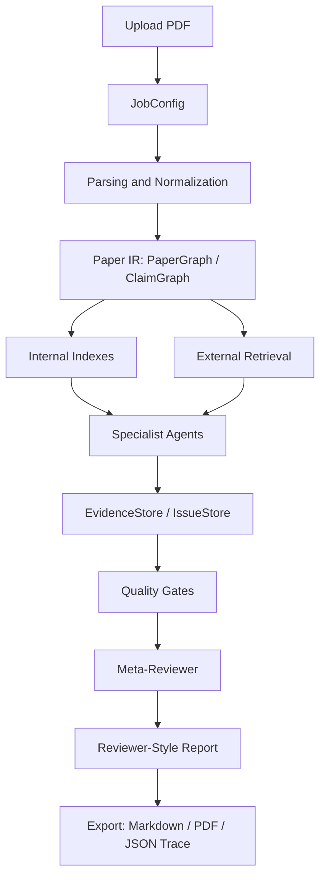

# AI Reviewer Agent

AI Reviewer Agent 是一个面向论文审稿的研究型、多代理、检索增强、证据驱动系统。核心交互是：用户上传论文 PDF，系统解析论文、构建 Paper IR、运行多代理审计、检索相关文献与 baseline，并生成带证据锚点的 reviewer-style 审稿意见、修改计划和审计 trace。

本项目不把重点放在“某一个模型是否足够强”，而是把 DeepSeek V4 Pro、GPT-5.5、Gemini、Claude 或本地 reviewer model 都封装为可替换的 LLM backend。系统质量主要来自 workflow、检索覆盖、证据锚定、结构化 agent contract 和质量门控。

## Project Map

```text
AI-reviewer/
  AGENTS.md                                      # 项目入口、系统简介、agent map
  研究报告.md                                    # AI 审稿系统与开源实现研究报告
  ai_reviewer_agent_system_design_v_0_1.md       # 早期系统设计草案
  docs/
    PRD.md                                      # 产品需求文档
    SYSTEM-DESIGN.md                            # 实现级系统设计
```

后续工程实现建议采用以下结构：

```text
ai-reviewer-agent/
  app/
    api/                  # HTTP API, job lifecycle, report export
    core/                 # config, schemas, LLM adapter, tool registry
    parsing/              # PDF/LaTeX parsing, table extraction, visual fallback
    indexing/             # chunk index, BM25/vector index, PaperGraph
    retrieval/            # query planner, academic search, reranking
    agents/               # orchestrator and specialist agents
    verification/         # gates, evidence checker, numeric checks
    reporting/            # report builder, PDF annotation, markdown export
  prompts/                # versioned prompts and JSON schemas
  configs/                # venue profiles, model routing, gate thresholds
  tests/                  # unit, integration, regression and eval fixtures
```

## Core Principles

- Research-oriented: 审稿前先理解问题、方法、claim、实验与相关研究脉络。
- Multi-agent: 每个 agent 负责一个可验证任务，避免一个模型一次性“凭感觉写审稿”。
- Retrieval-augmented: novelty、baseline、related work 和 benchmark 判断必须依赖外部检索。
- Evidence-grounded: 每条 major/fatal issue 必须有 paper evidence、external evidence 或 computed evidence。
- Gate-controlled: 没有完成解析、claim 覆盖、检索、数值校验和证据校验时，只能生成 partial report。
- Author-facing: 默认定位为投稿前审稿工具，帮助作者发现可能被 reviewer 质疑的问题，不替代正式评审决策。

## Agent Map

| Agent | Main Responsibility | Main Output |
|---|---|---|
| Orchestrator | 根据 JobConfig 和解析结果制定审稿 DAG，调度 specialist agents，检查 finalization gates | ReviewPlan, AgentRun records |
| Paper Summarizer | 只基于论文内部证据生成多粒度摘要 | PaperSummary |
| Claim Miner | 抽取 novelty、technical、theory、empirical、efficiency、privacy 等可审查 claim | ClaimGraph nodes |
| Field Historian | 通过外部文献把论文放入领域发展脉络 | Research lineage, closest method families |
| Baseline Scout | 查找漏掉的 baseline、dataset、metric、benchmark 和不公平比较风险 | MissingBaseline findings |
| Related Work Auditor | 检查 related work 是否覆盖关键研究线，是否避开 closest prior work | RelatedWork issues |
| Technical Soundness Auditor | 检查方法定义、符号、算法、公式和 claim 是否自洽 | Soundness issues |
| Theory / Proof Auditor | 在论文包含定理或保证时检查 assumptions、proof gap 和 claim overstatement | Proof issues |
| Experiment Auditor | 检查实验设置、baseline、ablation、seeds、variance、fairness 和 claim 支撑 | Experiment issues |
| Numeric Consistency Auditor | 用确定性程序校验表格数字、提升百分比、平均值、ranking 和 bold 标注 | Computed evidence |
| Reproducibility Auditor | 按目标会议标准审计代码、数据、超参、compute、prompt、closed API 说明 | Reproducibility issues |
| Writing & Presentation Auditor | 检查影响 reviewer 理解的结构、叙事、术语、图表和 claim 夸大问题 | Clarity issues |
| Ethics / Safety / Privacy Auditor | 检查人类数据、隐私、安全、misuse、IRB、data leakage 和政策风险 | Policy issues |
| Question Tree Generator | 把顶层审稿维度拆成 claim-specific question tree | QuestionTree |
| Evidence Answering Agent | 对每个 question node 基于内部和外部证据回答 supported/unsupported/unclear | Evidence-backed answers |
| Meta-Reviewer | 合并、去重、校准严重性、解决冲突，不引入新事实 | Verified issue set, final synthesis |
| Report Generator | 生成 PAT-style reviewer report、Actionable Revision Plan、Evidence Appendix 和 JSON trace | Markdown/PDF/JSON reports |

Default human-facing report output:

- `Summary`: 一段完整概述论文问题、方法、理论/实验证据和主要结论。
- `Strengths`: 4-8 条真正影响审稿判断的贡献或优点。
- `Weaknesses`: 4-8 条全局主要弱点，每条必须对应 IssueStore 记录。
- `Potential Issues And Suggestions`: 按 section/page range 分组，分别列出 `Potential Mistakes and Improvements` 与 `Minor Corrections and Typos`。
- `Evidence Appendix`: 每条 issue 的 evidence anchors、external evidence、computed checks、query log 和 gate status。
- `JSON Trace`: 面向调试、复现和机器消费的结构化 trace。

## Primary Workflow



## Document Map

- [docs/PRD.md](docs/PRD.md): 产品目标、用户流程、功能需求、非功能需求、成功标准和版本边界。
- [docs/SYSTEM-DESIGN.md](docs/SYSTEM-DESIGN.md): 多代理、RAG、证据机制、质量门控、数据结构、接口和工程架构。
- [docs/TECH-STACK.md](docs/TECH-STACK.md): 已定版技术栈，包括 Python/FastAPI、LangGraph、PostgreSQL/pgvector/Redis、Next.js/React、MinerU/PyMuPDF/GROBID。
- [docs/API.md](docs/API.md): 当前已实现 FastAPI 接口、请求/响应结构、错误码和 Bruno 调试入口。
- [bruno/AI Reviewer Agent/README.md](bruno/AI%20Reviewer%20Agent/README.md): Bruno Desktop collection 使用说明，用于本地 API 开发和测试。
- [docs/spec/README.md](docs/spec/README.md): 开发和维护规范目录，覆盖架构、API、数据模型、agent contract、prompt、证据门控、测试、代码风格、隐私安全和运维。
- [docs/roadmap.md](docs/roadmap.md): 工程实现路线图，从本地闭环到检索增强再到产品化。
- [研究报告.md](研究报告.md): 现有 AI 审稿系统、论文、开源实现和 PAT/ScholarPeer 类系统研究。
- [ai_reviewer_agent_system_design_v_0_1.md](ai_reviewer_agent_system_design_v_0_1.md): 早期系统设计草案，作为新版设计的历史参考。

## Tech Stack

- Backend: Python + FastAPI。
- Agent orchestration: LangGraph。
- Storage: PostgreSQL + pgvector + Redis。
- Frontend: Next.js + React + TypeScript。
- Python tooling: uv + ruff + pytest + mypy。
- Parser stack: MinerU + PyMuPDF + GROBID。
- LLM integration: OpenAI-compatible adapter for DeepSeek V4 Pro, GPT-5.5, and future providers。

## Recommended Build Order

1. Build PDF parsing to Paper IR: extract sections, chunks, references, tables, figures, equations and layout anchors.
2. Build internal indexes: dense retrieval, BM25, artifact index and citation mapping.
3. Build core multi-agent DAG: Summarizer, Claim Miner, Auditors, Question Tree, Evidence Answerer and Meta-Reviewer.
4. Build EvidenceStore and IssueStore: all findings must be traceable to paper, external or computed evidence.
5. Build quality gates: parsing, claim coverage, retrieval, evidence, numeric consistency, conflict, hallucination and actionability.
6. Build external retrieval: query planner, academic search adapters, reranker, external paper reader and Baseline Scout.
7. Build reporting: reviewer-style report, actionable revision plan, evidence appendix and JSON trace export.
