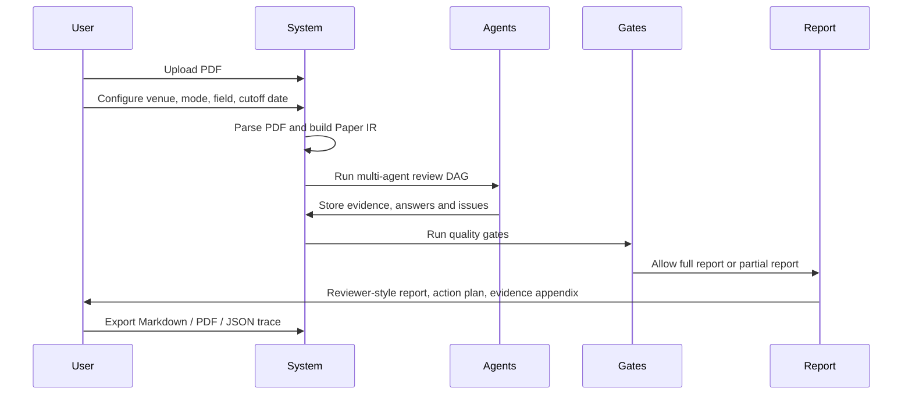

# PRD: AI Reviewer Agent

## 1. Background

AI Reviewer Agent 的目标是实现一个类似 Google PAT 体验的论文审稿工具：用户上传论文 PDF，系统像严格的 senior reviewer 一样理解论文、拆解 claim、检索相关工作、寻找缺失 baseline、审计实验和复现信息，并输出可追踪证据支撑的审稿意见。

公开资料没有披露 PAT 的完整代码、完整 prompt 或工具调用图。因此本产品不声称复现 PAT 内部实现，而是吸收 PAT 公告、ScholarPeer、DeepReviewer-v2、ReviewerAgent、TreeReview、MARG、OpenReviewer、Ai-Review 等系统的公开优势，形成一个研究型、多代理、检索增强、证据驱动的审稿 agent。

## 2. Product Goal

构建一个“传入 PDF，生成结构化审稿意见”的 AI Reviewer Agent 工具。

产品应帮助作者在投稿前发现：

- 论文 claim 是否缺乏证据。
- novelty 和 related work 是否站得住。
- 是否漏掉关键 baseline、dataset、metric 或 ablation。
- 方法、公式、算法和实验是否自洽。
- 表格数字、提升百分比和正文描述是否一致。
- 复现信息是否满足目标会议标准。
- 写作结构是否会影响 reviewer 理解。
- 是否存在伦理、安全、隐私或政策风险。

产品默认不输出正式 accept/reject 决策，不替代会议 reviewer，不参与正式评审流程。它输出 reviewer-style feedback、投稿风险点和可执行 revision plan。

## 3. Target Users

- 论文作者：投稿 NeurIPS、ICLR、ICML、ACL、EMNLP、AAAI、KDD、CVPR 等会议前进行自检。
- 研究团队：在组内 paper polishing 或 internal review 阶段统一检查论文质量。
- 博士生和研究助理：用系统学习 reviewer 会如何质疑实验、baseline、claim 和写作。
- 项目维护者：为未来系统实现、评测、prompt 迭代和产品化提供蓝图。

## 4. Core User Flow



## 5. Inputs

### Required Input

- Paper PDF.

### Optional Inputs

- LaTeX source ZIP.
- Supplementary material.
- Target venue, e.g. NeurIPS, ICLR, ICML, ACL.
- Research field and keywords.
- Review mode: Full Audit, Quick Audit, Baseline Audit, Revision Loop.
- External retrieval permission.
- Cutoff date for novelty and baseline search.
- Anonymization setting.
- User focus areas, e.g. novelty, experiments, reproducibility, clarity.

### JobConfig

```json
{
  "venue": "NeurIPS",
  "field": "machine learning / LLM agents",
  "review_mode": "full_audit",
  "manuscript_type": "conference_main_track",
  "cutoff_date": "2026-05-09",
  "external_retrieval": true,
  "anonymize_before_llm": true,
  "include_score_estimate": false,
  "focus": ["novelty", "technical_soundness", "experiments", "reproducibility", "clarity"]
}
```

## 6. Outputs

### Executive Summary

- 一句话总结。
- 3-5 个最可能影响审稿评分的问题。
- 最强贡献点。
- 最值得补的实验、文献、证明或复现信息。
- 投稿风险等级：high-risk、medium-risk、low-risk。

### Reviewer-Style Report

默认采用 PAT-style reviewer report 结构：

- Summary。
- Strengths。
- Weaknesses。
- Potential Issues And Suggestions。
- Evidence Appendix。
- Recommendation tendency，可选且默认关闭。

`Summary` 应是一段完整论文概述，覆盖研究问题、核心方法、理论/实验证据和主要结论。

`Strengths` 应列出 4-8 条真正影响审稿判断的优点，优先覆盖 novelty、technical contribution、system design、empirical support、privacy/safety/reproducibility。

`Weaknesses` 应列出 4-8 条全局主要弱点，每条必须对应一个或多个 IssueStore 记录。

`Potential Issues And Suggestions` 必须按论文 section/page range 分组，例如：

- `[Introduction, Background, and Problem Setup] (Pages: 1-3)`。
- `[Methodology and Architecture] (Pages: 3-6, 17-26)`。
- `[Theoretical Analysis and Proofs] (Pages: 6-7, 13-17)`。
- `[Experiments, Privacy Audits, and Robustness] (Pages: 7-10, 25-34)`。
- `[Conclusion, Impacts, and Meta-Review] (Pages: 9-13, 33-41)`。

每个 section group 内部固定包含：

1. `Potential Mistakes and Improvements`。
2. `Minor Corrections and Typos`。

如果某个区段没有显著问题，可以输出 `No significant issues found`，但必须基于 agent 检查结果和 gate 状态，不能因为没有生成问题就默认通过。

### Actionable Revision Plan

- Must fix before submission。
- Important improvements。
- Optional polish。
- Suggested additional experiments。
- Suggested related work additions。
- Suggested ablation table design。
- Suggested wording or LaTeX snippets when useful。

### Evidence Appendix

- 每条 issue 的证据卡。
- 检索 query log。
- 外部文献列表。
- 数值校验记录。
- parser warnings。
- agent disagreement records。
- finalization gate status。

### Export Formats

- Markdown report。
- PDF report。
- JSON trace。
- Optional annotated PDF。
- OpenReview-style private comment。

## 7. Functional Requirements

### FR1: PDF Parsing and Normalization

系统必须从 PDF 中提取：

- Title, abstract, sections and subsections。
- Paragraph chunks with page and layout anchors。
- Tables, figures, equations, algorithms and captions。
- References and citation mentions。
- Appendix and supplementary material when available。
- Parse warnings and confidence scores。

如果 PDF 解析质量不足，系统应提示用户上传 LaTeX source 或开启 visual fallback。

### FR2: Paper IR

系统必须构建可追踪的 Paper IR：

- PaperDocument。
- PaperChunk。
- Artifact index: tables, figures, equations, algorithms。
- PaperGraph。
- ClaimGraph。
- EvidenceStore。
- IssueStore。

所有 chunk 和 artifact 必须保留 page、section、quote 或 locator，保证最终 report 可以回溯。

### FR3: Internal Retrieval

系统必须支持论文内部检索：

- Dense vector search for semantic evidence。
- BM25 / keyword search for terms, symbols, datasets and baselines。
- Artifact search for tables, figures, algorithms and equations。
- Citation mapping from in-text citations to references。

### FR4: External Literature Retrieval

系统应支持外部学术检索，用于 novelty、baseline、related work 和 benchmark audit。

第一版可接入：

- arXiv。
- Semantic Scholar or OpenAlex。
- CrossRef。
- OpenReview。
- ACL Anthology when field is NLP。
- Papers with Code when task/benchmark is identifiable。
- GitHub Search as low-confidence implementation evidence。

外部证据必须分级：

- Level A: peer-reviewed papers, official benchmark pages。
- Level B: arXiv, OpenReview submission, technical reports。
- Level C: GitHub README, blogs, unofficial docs。
- Level D: search snippets and secondary summaries。

Major novelty/baseline concerns 不应只依赖 Level C/D 证据。

### FR5: Multi-Agent Review DAG

系统必须运行完整多代理工作流：

- Orchestrator。
- Paper Summarizer。
- Claim Miner。
- Field Historian。
- Baseline Scout。
- Related Work Auditor。
- Technical Soundness Auditor。
- Theory / Proof Auditor。
- Experiment Auditor。
- Numeric Consistency Auditor。
- Reproducibility Auditor。
- Writing & Presentation Auditor。
- Ethics / Safety / Privacy Auditor。
- Question Tree Generator。
- Evidence Answering Agent。
- Meta-Reviewer。
- Report Generator。

每个 agent 必须输出结构化 JSON，并写入 EvidenceStore、IssueStore 或 AgentRun log。

### FR6: Evidence Cards

每条 issue 必须包含：

- title。
- severity。
- dimension。
- concise description。
- paper evidence。
- external evidence。
- computed evidence。
- missing evidence。
- recommended fix。
- confidence。
- verified_by agents。

没有证据的 issue 不得进入 final major/fatal weakness，只能进入 possible concern requiring manual verification。

### FR7: Quality Gates

系统必须在最终报告前运行 gate：

- Parsing Gate。
- Claim Coverage Gate。
- Retrieval Gate。
- Evidence Gate。
- Numeric Gate。
- Conflict Gate。
- Hallucination Gate。
- Actionability Gate。

gate 未通过时，系统必须输出 partial report，并明确说明缺失项。

### FR8: Numeric Consistency Audit

系统必须用程序化方法校验：

- Average。
- Absolute improvement。
- Relative improvement。
- Ranking。
- Best/second-best bold or underline。
- Text claims like "improves by X%"。
- Main table vs appendix consistency。

LLM 只解释结果，不负责原始算术判断。

### FR9: Report Generation

Meta-Reviewer 和 Report Generator 只能基于 verified issues、EvidenceStore 和 AgentRun records 合成报告。最终报告不得引入未在 trace 中出现的新论文名、baseline、数据集、数值或事实。

Report Generator 必须生成 PAT-style reviewer report：

- 先生成全局 `Summary`、`Strengths`、`Weaknesses`。
- 再生成按 section/page range 分组的 `Potential Issues And Suggestions`。
- 每个 section group 必须区分 `Potential Mistakes and Improvements` 与 `Minor Corrections and Typos`。
- 每条 issue 应尽量包含问题标题、具体位置、审稿影响、建议修复方式和 evidence anchors。
- 理论、方法、实验、隐私、复现、格式 typo 等问题应保留细粒度，不得被压缩成少量笼统 bullets。
- 可以引用 reference paper，但引用必须来自 External Evidence Store，不能由模型自由补充。

### FR10: Revision Loop

系统应支持后续版本：

- 上传 v1 和 v2。
- 读取 v1 issue list。
- 检查 v2 是否解决 issue。
- 输出 resolved、partially resolved、unresolved、new issue。

## 8. Non-Functional Requirements

### Privacy

- 默认本地解析。
- 可选匿名化作者、单位、致谢、项目编号。
- 远端模型只发送必要 chunks。
- 不将 manuscript 用于训练。
- 支持 retention policy: immediate delete、temporary project storage、long-term workspace。
- 外部检索 query log 与 manuscript 分开存储。

### Reliability

- 所有 agent 输出必须 schema-validated。
- 所有工具调用必须记录 AgentRun。
- 每次 report 必须可复现：model、prompt version、input hash、tool calls、retrieval results 和 gate status。
- 解析失败、检索失败、模型超时必须降级为 partial report，而不是静默失败。

### Security

- 论文正文被视为 untrusted data。
- 系统 prompt 和 agent policy 不得被 manuscript 中的指令覆盖。
- 检索结果中的文本也被视为 untrusted data。
- 对外部引用和论文名做 hallucination check。

### Cost and Latency

- Quick Audit 目标：10-20 分钟内完成。
- Full Audit 目标：30-90 分钟内完成，取决于 PDF 长度、外部检索和模型预算。
- 系统必须支持 retrieval budget、agent budget、token budget 和 per-job cost tracking。

### Explainability

- 用户能从每条 issue 跳转到对应论文证据或外部证据。
- 用户能查看哪些 gate 通过、哪些 gate 未通过。
- 用户能导出 JSON trace 供 debug 或人工复核。

### Development and Maintenance

- 项目默认技术栈必须遵守 [TECH-STACK.md](TECH-STACK.md)。
- 开发、维护、测试、隐私安全和运维规范必须遵守 [spec/README.md](spec/README.md)。
- 新增 API、数据模型、agent、prompt、gate、外部服务或隐私行为时，必须同步更新对应 spec 文档。
- 后端默认使用 Python + FastAPI + LangGraph，存储默认使用 PostgreSQL + pgvector + Redis，前端默认使用 Next.js + React + TypeScript。
- Python 工程默认使用 uv、ruff、pytest、mypy；解析栈默认使用 MinerU、PyMuPDF、GROBID。

## 9. Review Modes

### Full Audit

完整审稿模式。运行 parsing、Paper IR、内部检索、外部检索、完整 agent DAG、quality gates 和 final report。

### Quick Audit

快速自检模式。运行 parsing、summary、claim extraction、internal consistency、numeric audit、writing audit 和 reproducibility audit。明确标注 novelty 和 baseline 检查不完整。

### Baseline Audit

专项查漏模式。重点运行 Query Planner、Field Historian、Baseline Scout、Related Work Auditor 和 external evidence appendix。

### Revision Loop

多版本修改闭环。对比 v1/v2，检查旧 issue 的解决情况和新引入问题。

## 10. Success Metrics

- Human issue recall: 人类 reviewer 提到的重要问题中，系统覆盖比例。
- Evidence precision: issue 所附证据是否真正支持该 issue。
- Hallucination rate: 虚构论文、baseline、数据集、数值比例。
- Severity calibration: major/fatal 是否对应真正高影响问题。
- Baseline discovery rate: 是否能发现关键 missing baseline。
- Numeric audit accuracy: 数字、提升、ranking 和 bold 标注检查准确率。
- Actionability score: 修改建议是否能直接指导作者修改。
- False positive burden: 用户需要忽略的无效批评比例。
- Report usefulness: 作者或领域专家对报告有用性的主观评分。

## 11. MVP Boundary

第一版按完整多代理工作流设计，但允许在工程落地时分阶段启用。

### MVP Must Have

- PDF parsing to Paper IR。
- Internal indexes。
- Summarizer。
- Claim Miner。
- Experiment, soundness, reproducibility, writing and numeric auditors。
- Question Tree。
- Evidence Answering Agent。
- Meta-Reviewer。
- Evidence Cards。
- Quality Gates。
- Markdown report and JSON trace。

### MVP Should Have

- External academic retrieval。
- Field Historian。
- Baseline Scout。
- Related Work Auditor。
- PDF report export。

### MVP Could Have

- Annotated PDF。
- Ask the Reviewer。
- Revision Loop。
- Team workspace。
- Venue-specific UI templates。

## 12. Out of Scope for First Release

- 自动接收/拒稿决策。
- 代替正式 reviewer 的会议评审流程。
- 训练专用 reviewer model。
- 复杂多人协作工作台。
- 对所有学科领域提供同等质量的 baseline search。
- 完整复现 PAT 的未公开内部实现。

## 13. Acceptance Criteria

一次 Full Audit 被认为成功，当且仅当：

- PDF 被解析为 Paper IR，并记录 parse confidence 和 warnings。
- 至少识别所有 major contribution claims。
- 每个 major claim 至少经过一个相关 auditor 检查。
- novelty/baseline 相关判断有外部检索记录。
- major/fatal issue 至少绑定一个 paper、external 或 computed evidence。
- 所有数值提升 claim 都经过 numeric audit 或被标记为无法校验。
- 最终报告不包含 EvidenceStore 之外的新事实。
- 用户可以导出 Markdown report 和 JSON trace。
