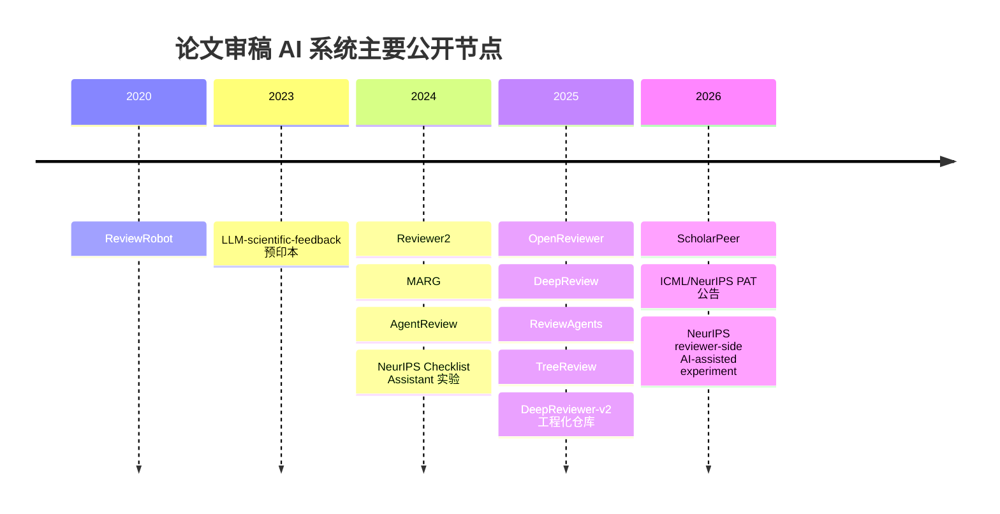
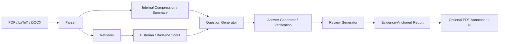

# AI大模型论文审稿系统与开源实现研究报告

## 执行摘要

截至 2026 年 5 月，AI 论文审稿/反馈系统已经明显分成三条技术路线：一是**单模型+强提示词**，代表是 urlWeixin-Liang/LLM-scientific-feedbackhttps://github.com/Weixin-Liang/LLM-scientific-feedback 与 urlNeuroDong/Ai-Reviewhttps://github.com/NeuroDong/Ai-Review；二是**面向审稿任务微调的专用模型**，代表是 urlmaxidl/openreviewerhttps://github.com/maxidl/openreviewer 与 DeepReview 系列；三是**检索增强、多代理、证据驱动**，代表是 urlallenai/marg-reviewerhttps://github.com/allenai/marg-reviewer、ScholarPeer、urlResearAI/DeepReviewer-v2https://github.com/ResearAI/DeepReviewer-v2、urlandrewtliem/ReviewerAgenthttps://github.com/andrewtliem/ReviewerAgent、urlYuanChang98/tree-reviewhttps://github.com/YuanChang98/tree-review。如果你的感受是“某些系统给出的反馈特别全面”，高概率不是因为一句 prompt 更神，而是因为它们把**检索、问题分解、基线追踪、证据锚定、模板化输出**这些步骤拆开了。citeturn43view0turn14view0turn41view0turn39view0turn16view0turn14view2turn37view0

对你最关心的 PAT 而言，高置信结论是：公开资料里**没有找到 PAT 的完整代码仓库，也没有找到完整 system prompt**。但在 entity["event","NeurIPS 2026","machine learning conference"] 官方说明中，PAT 被明确描述为由 Gemini 驱动、集成到 urlOpenReviewhttps://openreview.net、采用“reasoning-focused pipeline”的专用工具，只对作者私有可见，并且不会用于正式评审；最接近其技术公开披露的，是 ScholarPeer 论文与 urlGoogle Research 博文turn27search8，后者披露了“总结器 + 检索 + historian + baseline scout + 多维问答 + review generator”的框架，而且作者名单与 PAT 公告存在明显重叠。我的判断是：**PAT 大概率属于“搜索增强的多代理审稿助手”家族，而不是单轮 prompt 生成器**；但“PAT = ScholarPeer”这一点，官方并没有公开明说。citeturn47search1turn46search2turn28view0turn28view2turn27search8

## PAT 与“为什么它显得全面”

在 entity["event","NeurIPS 2026","machine learning conference"] 的 PAT 公告中，官方只公开了几个关键工程事实：PAT 使用 Gemini 模型与“reasoning-focused pipeline”；输出会覆盖实验/方法严谨性、英文叙事清晰度、技术正确性，以及整体 strength/weakness 分析；系统通过 OpenReview 里的 “Ready for LLM Feedback” 入口触发；作者私有可见；推理是 stateless，不会用提交稿训练模型；大 PDF 可能剥离图片后只处理文本；高峰期 turnaround 可能从 1–2 小时拉长到 12 小时。对一个正式会议来说，这已经足够说明它不是一个“聊天机器人前端”，而是有队列、配额、解析、上下文裁剪与隐私隔离的完整流水线。citeturn47search1turn46search2

PAT 给人“全面”的原因，公开资料最能解释的是 ScholarPeer 这类框架。ScholarPeer 将审稿拆为两条流：一条做**内部压缩**，即总结论文本身；另一条做**外部压缩**，即通过文献检索构建领域叙事。随后 historian agent 负责把论文放回学科演化脉络里，baseline scout agent 专门寻找作者漏掉的 baseline 与 dataset，多维 Q&A engine 再围绕 novelty、soundness、clarity 等维度发问并回答，最后由 review generator 按会议模板合成终稿。Google 的博文对这一框架也做了几乎同构的公开描述。citeturn28view0turn28view2turn30view0turn30view1turn30view2turn27search8

这类系统之所以比“给全文+让模型写审稿意见”更强，核心不在于更长的 prompt，而在于四个机制叠加：**动态外部上下文**，避免只靠参数记忆判断新颖性；**角色对抗**，尤其是 historian 与 baseline scout 这种“补背景/找漏评”的分工；**问答式审稿**，把“写审稿”转为“先问对问题再回答”；**证据锚定与模板约束**，逼迫系统把判断落到 paper text、检索结果或公式/表格/段落上。PAT 官方虽然没有逐行公开 prompt，但从 NeurIPS/ICML 说明与 ScholarPeer 的公开设计看，它的“全面感”高度可能来自这套结构化工作流。citeturn47search1turn46search4turn30view0turn30view1turn30view2

## 开源 GitHub 项目全景

说明：GitHub 网页在当前检索环境中经常**不稳定暴露精确 last commit 日期**。因此下表优先填“最近公开更新信号”：若 README/模型卡中有具体日期，则写具体日期；否则写 commit 数、发布状态或最近可见更新痕迹。citeturn20search1turn16view0turn41view0turn43view0

| 项目 | 仓库 | 主语言 / License | 最近公开更新信号 | 核心功能 | 所需工具 / API | 复现难度 | Prompt / Agent 设计线索 | 来源 |
|---|---|---|---|---|---|---|---|---|
| Ai-Review | urlNeuroDong/Ai-Reviewhttps://github.com/NeuroDong/Ai-Review | Python/Gradio/FastAPI 生态；MIT | README 更新到 2026-03-19；86 commits | Prompt 驱动审稿、Few-shot、SoT、VLM 审稿、Side-by-Side prompt 对比、Cursor Skill、中文提示词 | 自定义 LLM API；VLM 可选；本地 PDF/Word/LaTeX 读取 | 低到中 | 明确公开 SoT Prompt、VLM Prompt、Cursor Skill；强调证据锚定与 6 段式输出 | citeturn20search1turn15view2turn31view0turn32view0turn33view0 |
| DeepReviewer-v2 | urlResearAI/DeepReviewer-v2https://github.com/ResearAI/DeepReviewer-v2 | Python；MIT | README News 到 2026-03-04；387 stars；可导出 PDF 报告 | 从 PDF 到 Markdown 到可追踪审稿报告；支持注释回写；paper search；final gates | MinerU、DeepXiv 或 PASA、兼容 OpenAI 格式的 API | 中高 | 工具环 `pdf_read_lines / pdf_annotate / paper_search`；通过最小检索次数、最少注释数等 gate 控制最终写出 | citeturn16view0turn14view1turn16view2 |
| OpenReviewer | urlmaxidl/openreviewerhttps://github.com/maxidl/openreviewer | Python；仓库页未见明确代码 License | 7 commits；模型卡 README 2025-06-21 有更新 | Llama-OpenReviewer-8B；79k 专家审稿微调；PDF→Markdown→模板化审稿 | Marker、Hugging Face Space / model；本地训练脚本 | 中 | 核心不是 agent，而是“专用审稿模型 + 会议模板条件化” | citeturn41view0turn19search3turn35search0 |
| LLM-scientific-feedback | urlWeixin-Liang/LLM-scientific-feedbackhttps://github.com/Weixin-Liang/LLM-scientific-feedback | Python；CC-BY-4.0 | 9 commits；531 stars | GPT-4 全文 PDF 反馈；Web UI；大规模实证论文配套代码 | ScienceBeam PDF parser、LLM API | 低到中 | 更像“单模型+解析服务”的实证原型；公开 prompt 线索较少 | citeturn43view0 |
| ReviewerAgent | urlandrewtliem/ReviewerAgenthttps://github.com/andrewtliem/ReviewerAgent | Python/JS/CSS/HTML/Shell；MIT | 10 commits；无 release | Parser / Validator / Finder / Ranking / Reviewer 多代理流水线；实时日志；JSON 输出 | Gemini API、Tavily、arXiv、MarkItDown | 中 | 最像 “ScholarPeer-lite” 的公开工程实现：检索、排序、引用 top-5 后再评审 | citeturn14view2turn15view1turn15view3 |
| MARG | urlallenai/marg-reviewerhttps://github.com/allenai/marg-reviewer | Python/HTML；Apache-2.0 | 7 commits；63 stars | Web demo；多风格 reviewer 生成（SARG-B/LiZCa/MARG-S）；复现实验脚本 | Docker、API key、AWS 可选、ARIES 数据集、GROBID | 中高 | 典型多代理 review generation；对齐与指标复现实验较完整 | citeturn39view0 |
| ReviewRobot | urlEagleW/ReviewRobothttps://github.com/EagleW/ReviewRobot | Python；MIT | 7 commits；老项目但代码完整 | KG 驱动的 score prediction + template comment generation；解释性强 | PyTorch、NetworkX、PeerRead/自带数据、SciIE 结果 | 中高 | 不是 LLM agent，而是“知识图谱+模板”路线；解释性强但现代泛化较弱 | citeturn40view0turn13search3 |
| TreeReview | urlYuanChang98/tree-reviewhttps://github.com/YuanChang98/tree-review | Python；仓库页未见明确 License | 5 commits；14 stars | 动态问题树；自顶向下拆问题、自底向上聚合答案；附 benchmark | Python 3.11；本地数据集 | 中 | 显式把审稿建模成层级问答树，强调深度与 token 效率 | citeturn37view0turn36search10 |
| ReviewRobot 之后的额外发现 | — | — | — | 还发现 ReviewAgents、ScholarPeer、PAT 等重要系统，但目前未发现其公开 GitHub 代码仓库；它们更适合作为论文/官方系统描述来参考 | — | — | 多数属于 retrieval/agentic 路线，而不是 prompt-only | citeturn36search0turn28view0turn47search1 |

从工程可复用性看，**现成能直接拿来改**的优先级大致是：如果你要最快做出作者反馈系统，先看 Ai-Review 与 LLM-scientific-feedback；如果你要做“像 PAT 一样全面且可追踪”的系统，DeepReviewer-v2、ReviewerAgent、MARG、TreeReview 更有参考价值；如果你要做低成本高质量 baseline，OpenReviewer 是最强的“专用模型路线”；如果你要做强解释性的老派基线或教学用途，ReviewRobot 很适合。citeturn14view0turn43view0turn16view0turn14view2turn39view0turn37view0turn41view0turn40view0

对中文开发者尤其有价值的是，Ai-Review 已经提供中文 SoT prompt、中文 Skill 说明与中文 VLM prompt；DeepReviewer-v2 仓库也直接挂出了中文文档入口。因此如果你的目标是做中文论文自检或“投稿前审稿助手”，这两条路线会比 ScholarPeer/PAT 更容易真正落地。citeturn33view0turn31view0turn16view0

## 关键论文与预印本

| 论文 | 年份 | 核心思想 / 架构 | 数据集 / 评测 | 代码是否公开 |
|---|---|---|---|---|
| urlReviewRobothttps://aclanthology.org/2020.inlg-1.44/ | 2020 | 通过目标论文 KG、引用工作 KG、背景 KG 进行分数预测与模板化评论生成，强调 explainability | 仓库给出 8,110 对 paper-review 与 174,165 篇背景论文构成的数据 | 是：urlRepohttps://github.com/EagleW/ReviewRobot citeturn13search3turn40view0 |
| urlCan large language models provide useful feedback on research papers?https://arxiv.org/abs/2310.01783 | 2023 预印本 / 2024 后续发表 | 用 GPT-4 对整篇 PDF 给作者反馈，并做大规模效用评估 | 15 个 Nature 期刊 3,096 篇、ICLR 1,709 篇、308 名研究者用户研究 | 是：urlRepohttps://github.com/Weixin-Liang/LLM-scientific-feedback citeturn43view0 |
| urlReviewer2https://arxiv.org/abs/2402.10886 | 2024 | 两阶段 review generation：先生成“审稿角度/方面”，再据此写评审，解决覆盖面不足 | 我检到的公开摘要主要强调两阶段框架；更细实验细节需回原文 | 未在此次检索中确认公开仓库 citeturn13search5 |
| urlMARGhttps://arxiv.org/abs/2401.04259 | 2024 | Multi-agent review generation；不仅生成 review，还做用户研究与多方法对齐评估 | 仓库可复现实验，并使用 ARIES 数据集 | 是：urlRepohttps://github.com/allenai/marg-reviewer citeturn39view0 |
| urlAgentReviewhttps://arxiv.org/abs/2406.12708 | 2024 | 不是作者反馈工具，而是 LLM peer-review simulation framework，用于研究 peer review bias 与机制 | 论文报告 37.1% 决策变化可归因于 reviewer bias 等因素 | 论文站点宣称有代码；此次检索未展开到完整仓库说明 citeturn13search0turn13search9turn13search7 |
| urlOpenReviewerhttps://aclanthology.org/2025.naacl-demo.44/ | 2024 预印本 / 2025 NAACL Demo | 用 79k ICLR/NeurIPS 专家评审微调 Llama-3.1-8B-Instruct，形成专用审稿模型 | 400 篇测试论文；输出更 critical，推荐分布更接近人类 reviewer | 是：urlRepohttps://github.com/maxidl/openreviewer；urlModelhttps://huggingface.co/maxidl/Llama-OpenReviewer-8B citeturn41view0turn35search0turn19search3 |
| urlDeepReviewhttps://aclanthology.org/2025.acl-long.1420/ | 2025 ACL | 多阶段“类人深思”框架，结合结构化分析、文献检索、证据式论证；训练 DeepReviewer 模型 | DeepReview-13K；DeepReviewer-14B 在 win-rate 上超过 CycleReviewer-70B，并以更少 token 对抗更大模型 | 是：论文页与预印本均指向公开资源；工程版仓库可参考 urlDeepReviewer-v2 Repohttps://github.com/ResearAI/DeepReviewer-v2 citeturn35search7turn35search1turn16view0 |
| urlReviewAgentshttps://arxiv.org/abs/2503.08506 | 2025 预印本 | 多角色、多 LLM 审稿框架；配套 Review-CoT 与 ReviewBench | Review-CoT 142k review comments；ReviewBench 用于比较人类与 AI review | 此次检索未确认公开代码 citeturn36search0turn36search3 |
| urlTreeReviewhttps://aclanthology.org/2025.emnlp-main.790/ | 2025 EMNLP | 动态问题树框架：递归拆问题、逐层汇总回答，兼顾深度与效率 | 基于 ICLR/NeurIPS 派生 benchmark；据论文可将 token 开销降至强基线的 20% 左右 | 是：urlRepohttps://github.com/YuanChang98/tree-review citeturn36search10turn36search4turn37view0 |
| urlScholarPeerturn3view0 | 2026 预印本 | search-enabled multi-agent 审稿框架；historian + baseline scout + Q&A engine + review generator | DeepReview-13K；还引入 H-Max 与 review diversity；评测用 Gemini 3 Pro backbone、Claude Sonnet 4.5 作为 judge | 此次检索未发现公开代码 citeturn28view0turn28view2turn26search0 |

从论文脉络看，领域在 2024–2026 的主线非常清晰：**单模型生成** → **多阶段 reasoning** → **多代理 + 检索增强** → **任务专用模型 / benchmark 化**。真正把“全面、像资深 reviewer”推上去的节点，是 DeepReview、TreeReview 与 ScholarPeer 这三类“先提问题、再找证据、再写评审”的系统。citeturn13search5turn35search7turn36search10turn28view0

下面这张时间线概括了公开发表与公开系统落点：

这条时间线由 ACL Anthology、arXiv、NeurIPS 官方博客与各仓库 README 共同支持；它也解释了为什么 2026 年的 PAT 会比 2023 年的“直接让 GPT-4 读 PDF 给建议”明显更像一个系统，而不是一个 prompt。citeturn40view0turn43view0turn13search5turn39view0turn35search7turn36search10turn28view0turn47search1turn46search2

## 系统横向比较与 prompt / agent 设计

### 核心系统对比

| 系统 | 架构 | 检索 / 工具 | 模型后端 | 证据锚定 / 可追踪性 | Prompt / 设计模式 | 典型流水线 | 评测 / 定位 |
|---|---|---|---|---|---|---|---|
| PAT | 多阶段、很可能带 agent orchestration；官方未公开完整结构 | OpenReview 集成；会做 PDF 裁剪；外部检索细节未公开 | Gemini reasoning-focused pipeline | 作者私有、与正式评审隔离；官方未公开逐条 trace 形式 | 官方未公开 prompt；强调 strength/weakness、rigor、clarity、correctness | PDF 入队 → 私有反馈评论 → 作者查看 | 面向投稿前作者反馈，不进入正式评审 citeturn47search1turn46search2 |
| ScholarPeer | 多代理 | 动态 web-scale literature search；historian；baseline scout；Q&A engine | Gemini 3 Pro；judge 用 Claude Sonnet 4.5 | 有“interrogation log”思想，强调验证式问答 | venue guideline + Q&A log + cutoff-date search constraint | summary / literature / historian / scout → question generation → answer generation → review generation | DeepReview-13K、H-Max、Spearman、SxS citeturn28view0turn30view0turn30view1turn30view2 |
| Stanford Agentic Reviewer | 公开材料不足 | 未能在本次检索中确认稳定公开论文/代码 | 未知 | 未知 | 未知 | 未知 | 建议在使用前先核实名称是否指某个未公开 demo / 商业系统 |
| DeepReviewer-v2 | 多代理 / 工具环 | MinerU、DeepXiv 或 PASA、行级读取与页面注释 | 兼容 OpenAI 格式 API；默认示例为 gpt-5.2 | 很强：paper_search 次数、annotation 数、final gates、final_report.pdf | 更像“tool policy”而非纯 prompt | PDF→Markdown→tool loop→写 Markdown→导出 PDF | 工程化、可部署、追踪性极强 citeturn14view1turn16view0turn16view2 |
| OpenReviewer | 单模型专用微调 | PDF→Markdown，基本无 live retrieval | Llama-OpenReviewer-8B | 中等：模板化输出，但外部证据弱 | venue template conditioning | parse→template→generate | 400 test papers，面向 ML/AI 会议审稿风格 citeturn41view0turn35search0 |
| LLM-scientific-feedback | 单模型 + 解析服务 | ScienceBeam PDF parser；无 live retrieval | GPT-4 | 中等偏弱：能给出细致评论，但外部文献锚定弱 | prompt 未公开为核心卖点 | PDF parser→全文输入→反馈生成 | 强实证研究；面向作者早期反馈 citeturn43view0 |
| ReviewerAgent | 多代理 | Tavily、arXiv、MarkItDown、academic domain filter | Gemini | 中等：top-5 citation ranking 之后再审稿 | parser / validator / finder / ranking / reviewer 分工 | upload→parse→validate→search→rank→review | 开源 demo，适合理解 PAT/ScholarPeer 风格工程骨架 citeturn14view2turn15view1 |
| Ai-Review | 单模型 + 强 prompt；可加 VLM | PDF/Word/LaTeX 读取；VLM 读页面截图 | 自接任意 API / VLM | 中等偏强：显式要求 evidence anchors 与缺证据回退 | SoT、Few-shot、Reverse Prompt、VLM Prompt | parse→选择 prompt 模式→结构化 review | 面向作者自检，中文支持好 citeturn14view0turn31view0turn32view0turn32view2 |
| MARG | 多代理 | Web demo、用户研究、GROBID/数据复现 | 论文实验基于 API 驱动 | 中等：更关注对齐与 user study | reviewer persona / method ensemble | submit→multiple methods→result/survey page | 研究型系统，实验复现完整 citeturn39view0 |
| TreeReview | 树式多阶段问答 | 问题树 + 动态扩展；是否 live retrieval 不是主卖点 | LLM 驱动 | 中等偏强：Q/A 树天然带 trace | hierarchical question decomposition | build question tree→answer leaf→aggregate root | 深度与效率兼顾，token 成本低 citeturn36search10turn37view0 |

如果把这些系统压缩成一句工程结论：**PAT/ScholarPeer/ReviewerAgent/DeepReviewer-v2** 属于“研究型、多代理、检索增强、证据驱动”一类；**OpenReviewer/DeepReview** 属于“任务专用模型/多阶段 reasoning”一类；**Ai-Review/LLM-scientific-feedback** 属于“prompt-first 作者反馈器”一类。你觉得 PAT 的意见“很全面”，最像的不是 OpenReviewer，而是 ScholarPeer 加 ReviewerAgent 再加 DeepReviewer-v2 里的可追踪工具环。citeturn47search1turn28view0turn14view2turn16view0turn41view0turn43view0

### 公开可抽取的 prompt / agent 模式

我检到的**最有复用价值**而且确实公开的 prompt / agent 线索有四组。

第一组来自 ScholarPeer。它不是直接让模型“写审稿意见”，而是先把模型变成“找漏 benchmark 的人”“提出 novelty 问题的人”“只能在 cutoff date 之前找 prior art 的回答者”。其中 baseline scout 的角色设定非常激进：它把 agent 定义成一个专门找作者**漏比较对象**的角色；answer generator 还加了严格的 cutoff-date 约束，只允许使用论文发布日期之前的先验工作。这就是它比普通 RAG 审稿更“毒辣”的原因。citeturn30view0turn30view1

第二组来自 Ai-Review。它把 prompt 的重点放在**输出格式纪律**和**证据锚定纪律**：必须按六个固定 section 输出；不给分、不下 accept/reject；每条判断都要有 evidence anchor；没证据时要显式承认缺证据。这种 prompt 不是“让模型更聪明”，而是强迫模型少装懂。对于作者反馈场景，这往往比“更会写”更重要。citeturn31view0turn32view0turn32view2

第三组来自 DeepReviewer-v2。它没有公开漂亮的长 system prompt，但公开了更关键的工程约束：只有当检索调用次数、不同 query 数、注释数量达到阈值后，系统才允许 finalization。这个设计非常值得抄，因为它把“全面审稿”从文风问题变成了**流程完成度问题**。很多系统输就输在“模型太早结束”。citeturn14view1turn16view2

第四组来自 OpenReviewer。它的秘诀不是多代理，而是把输出绑定到会议模板，把“真实 reviewer 会怎么写”学进模型。也就是说，它更像一个**风格与分布都校准过的 reviewer simulator**。如果你的目标是“像 ICLR reviewer 一样写”，而不是“像资深研究员一样主动找漏 baseline”，这条路线会比 ScholarPeer 类系统更省工程。citeturn41view0turn35search0

受版权与公开材料限制，我这里只放可合规短摘录。来自 ScholarPeer 的公开 prompt 片段包括对 baseline scout 的角色设定“**ferocious benchmarking expert**”以及对回答代理的能力要求“**with access to ... search**”；来自 Ai-Review 的关键约束包括“**Every claim MUST be supported by evidence anchors**”以及缺证据回退语“**No direct evidence found in the manuscript**”。PAT 本身的完整 prompt，在官方公告和公开论文外部都没有放出。citeturn30view0turn30view1turn32view0

下面这张图把 PAT/ScholarPeer/DeepReviewer-v2/ReviewerAgent 一类系统的共同骨架抽象出来：

这不是某一个项目的逐字复制，而是对 ScholarPeer、DeepReviewer-v2、ReviewerAgent、MARG 和 TreeReview 共性流程的归纳：**先理解论文，再补外部上下文，再提问题，再做验证，最后按模板写 review。**citeturn28view2turn30view0turn30view1turn16view0turn14view2turn39view0turn37view0

## 实现建议与开放问题

如果你要自己做一个“接近 PAT 体验”的最小可复现系统，我建议的栈是：**解析层**用 MinerU / Marker / ScienceBeam / GROBID 中的一种；**检索层**至少接 arXiv + OpenReview + 一个通用学术检索；**推理层**不要只保留一个 reviewer agent，至少拆成 summarizer、baseline scout、question generator、answer generator、review generator 五步；**输出层**必须做 evidence anchor、缺证据回退、venue template conditioning；如果预算允许，再加 PDF 页面批注与最终 PDF 报告导出。这个建议不是拍脑袋，而是把 DeepReviewer-v2、ReviewerAgent、Ai-Review、OpenReviewer、MARG、Liang 等系统里真正有效的东西抽取出来后的最小交集。citeturn16view0turn14view2turn32view2turn41view0turn39view0turn43view0

按工程投入粗估：**周末原型**可以做成“解析 + 单模型 + 六段式输出”的 Ai-Review/LLM-scientific-feedback 类系统；**一到两周**可以加上 baseline 检索与 evidence anchor，做成可用的作者反馈器；**三到六周**能做出类似 ReviewerAgent / TreeReview / DeepReviewer-v2 的多阶段系统；如果再加 OpenReview 队列、配额、异步状态、私有评论写回、stateless inference 声明和审计日志，才会开始接近 PAT/会议级部署。这个工期是基于公开仓库暴露出的组件数量与外部依赖做的工程估算。citeturn14view2turn37view0turn16view0turn47search1

隐私与数据处理上，PAT/NeurIPS 的公开做法非常值得照抄：与正式评审严格隔离、只对作者可见、stateless inference、不拿稿件训练、日志匿名化。对于自建系统，我会进一步建议：**本地解析优先、远端只发必要片段；作者/单位/致谢在解析后先脱敏；检索结果与最终 review 分开存储；所有外部搜索要记录 query、时间、来源；最终报告必须让用户能回溯每条判断来自哪一段 paper 或哪条外部证据。**前两条是官方做法，后几条是结合开源系统后的工程推断。citeturn47search1turn46search2turn16view0turn31view0

最常见的坑也已经在公开资料里出现了。第一，**解析质量**常常比模型质量更致命：ScienceBeam 仅支持 x86 Linux；PAT 对大 PDF 可能剥离图片；Ai-Review 才会专门为 VLM/版式做额外 prompt。第二，**系统可能过严或不准**：NeurIPS 2024 Checklist Assistant 的作者反馈里，最常见问题就是不准确与过严。第三，**如果把作者助手当自动审稿门槛，会被游戏化**：NeurIPS 2024 的攻击实验已经说明，仅修改 checklist justification、不改论文内容，也可能显著提升自动评分。第四，**没有外部检索的新颖性判断很容易“参数真空”**——这正是 ScholarPeer 明确批评前代系统的点。citeturn43view0turn47search1turn46search0turn14view0turn28view0turn28view2

开放问题与局限也需要明确写出来。第一，PAT 的**完整 prompt、工具调用图、失败恢复策略、citation trace 格式**都没有公开；因此任何“PAT 的具体实现”目前都只能做到**高可信推断**，做不到逐文件复现。第二，我**没有找到与“Stanford Agentic Reviewer”这一名称精确匹配、且可稳定核验的公开论文或代码**，所以报告里把它作为“公开信息不足”的占位而不是硬分析。第三，GitHub 网页在当前检索环境下对**exact last commit date**抽取不稳定，因此仓库表使用了“最近公开更新信号”替代。就“如何自己实现一个全面、像资深 reviewer 的系统”而言，这些局限不会改变主结论：**最值得复用的不是某句神秘 prompt，而是“检索增强 + 问题分解 + 漏基线侦察 + 证据锚定 + 模板约束”这一系统范式。**citeturn47search1turn28view0turn30view0turn16view0turn14view2turn31view0